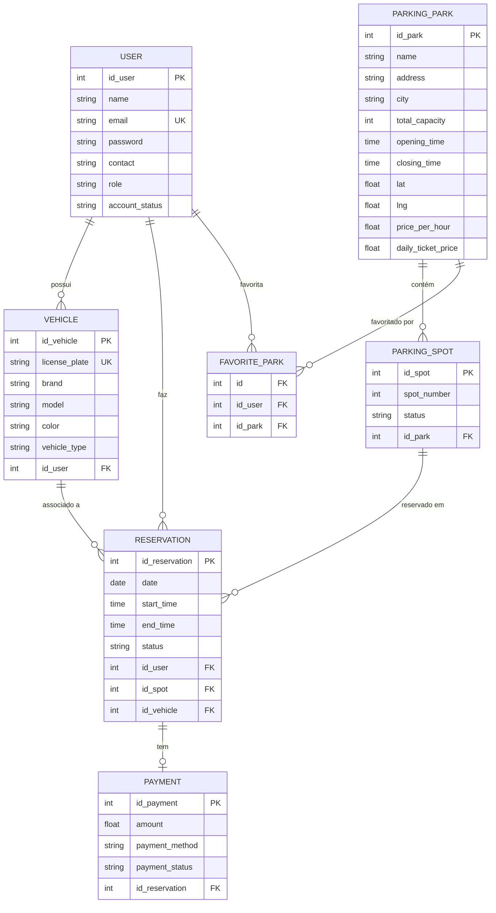

<p align="center">
  
  
  
  
  
  
</p>

<h1 align="center">🅿️ Smart Parking</h1>

<p align="center">
  <strong>Plataforma inteligente de gestão de estacionamento</strong><br/>
  Reservas em tempo real · Pagamentos integrados · Painel de administração
</p>

<p align="center">
  <a href="#-funcionalidades">Funcionalidades</a> •
  <a href="#%EF%B8%8F-arquitetura">Arquitetura</a> •
  <a href="#-instalação">Instalação</a> •
  <a href="#-api">API</a> •
  <a href="#-testes">Testes</a> •
  <a href="#-estrutura-do-projeto">Estrutura</a>
</p>

---

## 📋 Sobre o Projeto

O **Smart Parking** é uma plataforma web full-stack para gestão inteligente de estacionamento urbano. Permite aos utilizadores consultar a disponibilidade de lugares em tempo real, efetuar reservas com pagamento integrado e gerir os seus veículos — tudo a partir de uma interface moderna e responsiva. Administradores têm acesso a um painel completo com estatísticas, gestão de parques, utilizadores e reservas.

> **Grupo 11** — Projeto Final

---

## ✨ Funcionalidades

### 👤 Utilizadores
- **Registo e autenticação** com JWT (JSON Web Tokens)
- **Gestão de perfil** — editar dados pessoais e contacto
- **Gestão de veículos** — adicionar, listar e remover veículos associados
- **Parques favoritos** — marcar/desmarcar parques como favoritos

### 🅿️ Parques e Reservas
- **Mapa interativo** com localização de todos os parques disponíveis
- **Consulta de disponibilidade** em tempo real (lugares livres/ocupados)
- **Sistema de reservas** com seleção de data, hora e lugar
- **Bilhete diário** ou **reserva por hora** com cálculo automático de preço
- **Pagamento imediato ou diferido** (pagar agora ou pagar depois)
- **Cancelamento de reservas** com libertação automática do lugar
- **Limpeza automática** de reservas expiradas (executa a cada 30 segundos)

### 🛡️ Painel de Administração
- **Dashboard com estatísticas** — total de utilizadores, reservas, receita e taxa de ocupação
- **Gestão de parques** — criar, editar e eliminar parques (com geração automática de lugares)
- **Gestão de utilizadores** — listar, bloquear e ativar contas
- **Gestão de reservas** — visualizar todas as reservas do sistema com detalhes completos
- **Gráficos de evolução mensal** de reservas e receita

---

## 🏗️ Arquitetura

O projeto segue o padrão **MVC (Model-View-Controller)**:

```
┌─────────────────────────────────────────────────────┐
│                    CLIENTE (Browser)                 │
│         HTML / CSS / JavaScript (Vanilla)            │
├─────────────────────────────────────────────────────┤
│                 SERVIDOR (Node.js + Express)         │
│  ┌───────────┐  ┌──────────────┐  ┌──────────────┐  │
│  │  Routes   │→ │ Controllers  │→ │   Models     │  │
│  │           │  │              │  │ (Sequelize)  │  │
│  └───────────┘  └──────────────┘  └──────┬───────┘  │
├──────────────────────────────────────────┼──────────┤
│                  BASE DE DADOS           │          │
│                  MySQL / MariaDB         │          │
└──────────────────────────────────────────┴──────────┘
```

**Stack Tecnológico:**

| Camada       | Tecnologia                          |
|:-------------|:------------------------------------|
| Frontend     | HTML5, CSS3, JavaScript (Vanilla)   |
| Backend      | Node.js, Express 5                  |
| ORM          | Sequelize 6                         |
| Base de Dados| MySQL                               |
| Autenticação | JSON Web Tokens (JWT) + bcrypt      |
| Mapas        | Leaflet.js (mapa interativo)        |
| Testes E2E   | Selenium WebDriver                  |

---

## 🚀 Instalação

### Pré-requisitos

- [Node.js](https://nodejs.org/) (v18 ou superior)
- [MySQL](https://www.mysql.com/) ou [MariaDB](https://mariadb.org/)
- [Git](https://git-scm.com/)

### Passos

**1. Clonar o repositório**

```bash
git clone https://github.com/thiagoluz11/SMART-PARKING-FINAL.git
cd SMART-PARKING-FINAL
```

**2. Instalar dependências**

```bash
npm install
```

**3. Configurar variáveis de ambiente**

Criar um ficheiro `.env` na raiz do projeto:

```env
DB_HOST=localhost
DB_PORT=3306
DB_USER=root
DB_PASS=sua_password
DB_NAME=smart_parking
DB_DIALECT=mysql
JWT_SECRET=sua_chave_secreta
PORT=3000
```

**4. Iniciar o servidor**

```bash
npm start
```

O servidor irá:
1. Conectar-se à base de dados MySQL
2. Sincronizar automaticamente todos os modelos/tabelas (via Sequelize)
3. Executar limpeza de reservas expiradas
4. Iniciar na porta configurada (padrão: `3000`)

**5. Aceder à aplicação**

Abra o browser em: `http://localhost:3000/views/index.html`

### Seed de Dados (Opcional)

Para popular a base de dados com dados de teste:

```bash
node database/seeds.js        # Dados gerais
node database/seedSpots.js    # Lugares de estacionamento
```

---

## 📡 API

A API REST está documentada em detalhe no ficheiro [`API_DOCUMENTATION.md`](API_DOCUMENTATION.md).

### Resumo dos Endpoints

| Método   | Endpoint                        | Descrição                          | Auth   |
|:---------|:--------------------------------|:-----------------------------------|:-------|
| `POST`   | `/users/register`               | Registar novo utilizador           | ❌     |
| `POST`   | `/users/login`                  | Login (devolve JWT)                | ❌     |
| `GET`    | `/users/me`                     | Obter perfil do utilizador         | 🔒     |
| `PUT`    | `/users/me`                     | Atualizar perfil                   | 🔒     |
| `GET`    | `/users/me/vehicles`            | Listar veículos                    | 🔒     |
| `POST`   | `/users/me/vehicles`            | Adicionar veículo                  | 🔒     |
| `DELETE` | `/users/me/vehicles/:id`        | Remover veículo                    | 🔒     |
| `GET`    | `/users/me/favorites`           | Listar favoritos                   | 🔒     |
| `POST`   | `/users/me/favorites`           | Adicionar favorito                 | 🔒     |
| `DELETE` | `/users/me/favorites/:parkId`   | Remover favorito                   | 🔒     |
| `GET`    | `/api/parks`                    | Listar todos os parques            | ❌     |
| `GET`    | `/api/parks/:id/spots`          | Listar lugares de um parque        | ❌     |
| `POST`   | `/reservations`                 | Criar reserva                      | 🔒     |
| `GET`    | `/reservations/me`              | Listar reservas do utilizador      | 🔒     |
| `PUT`    | `/reservations/:id/cancel`      | Cancelar reserva                   | 🔒     |
| `PUT`    | `/reservations/:id/pay`         | Pagar reserva pendente             | 🔒     |
| `GET`    | `/admin/stats`                  | Estatísticas gerais                | 🔒👑   |
| `GET`    | `/admin/users`                  | Listar utilizadores                | 🔒👑   |
| `PUT`    | `/admin/users/:id/status`       | Bloquear/ativar utilizador         | 🔒👑   |
| `GET`    | `/admin/reservations`           | Listar todas as reservas           | 🔒👑   |
| `POST`   | `/admin/parks`                  | Criar parque                       | 🔒👑   |
| `PUT`    | `/admin/parks/:id`              | Editar parque                      | 🔒👑   |
| `DELETE` | `/admin/parks/:id`              | Eliminar parque                    | 🔒👑   |

> 🔒 = Requer autenticação JWT &nbsp;&nbsp;|&nbsp;&nbsp; 👑 = Requer privilégios de Admin

---

## 🧪 Testes

O projeto inclui uma suite abrangente de **testes end-to-end (E2E)** com **Selenium WebDriver**, cobrindo todos os fluxos críticos da aplicação.

### Suites de Testes

| Suite                | Descrição                                  |
|:---------------------|:-------------------------------------------|
| `login.js`           | Autenticação e validações de login         |
| `registo.js`         | Registo de novos utilizadores              |
| `index.js`           | Página inicial e navegação                 |
| `dashboard.js`       | Dashboard do utilizador                    |
| `reservas.js`        | Criação e gestão de reservas               |
| `veiculos.js`        | Gestão de veículos                         |
| `perfil.js`          | Edição de perfil                           |
| `navegacao.js`       | Navegação geral entre páginas              |
| `admin-dashboard.js` | Dashboard de administração                 |
| `admin-parques.js`   | Gestão de parques (admin)                  |
| `admin-reservas.js`  | Gestão de reservas (admin)                 |
| `admin-utilizadores.js` | Gestão de utilizadores (admin)          |

### Executar Testes

```bash
# Executar todos os testes sequencialmente
npm test

# Executar via runner personalizado
npm run selenium

# Executar em paralelo
npm run selenium:parallel

# Executar uma suite específica
npm run test:login
npm run test:dashboard
npm run test:admin
```

---

## 📁 Estrutura do Projeto

```
SMART-PARKING-FINAL/
├── app.js                      # Ponto de entrada da aplicação
├── package.json                # Dependências e scripts
├── .env                        # Variáveis de ambiente
├── API_DOCUMENTATION.md        # Documentação completa da API
│
├── models/                     # Modelos Sequelize (camada de dados)
│   ├── index.js                # Configuração e associações Sequelize
│   ├── User.js                 # Modelo de utilizador
│   ├── Vehicle.js              # Modelo de veículo
│   ├── ParkingPark.js          # Modelo de parque de estacionamento
│   ├── ParkingSpot.js          # Modelo de lugar de estacionamento
│   ├── Reservation.js          # Modelo de reserva
│   ├── Payment.js              # Modelo de pagamento
│   ├── FavoritePark.js         # Modelo de parque favorito
│   └── Model.js                # Modelo base / utilitários
│
├── controllers/                # Lógica de negócio
│   ├── Controller.js           # Controlador principal (parques, veículos, favoritos)
│   ├── usercontroller.js       # Controlador de autenticação e perfil
│   ├── reservationController.js# Controlador de reservas e pagamentos
│   └── cleanupController.js    # Limpeza automática de reservas expiradas
│
├── routes/                     # Definição de rotas da API
│   ├── users.js                # Rotas de utilizadores e veículos
│   ├── parks.js                # Rotas de parques e lugares
│   ├── reservations.js         # Rotas de reservas
│   └── admin.js                # Rotas de administração
│
├── views/                      # Páginas HTML (frontend)
│   ├── index.html              # Landing page
│   ├── login.html              # Página de login
│   ├── register.html           # Página de registo
│   ├── dashboard.html          # Dashboard do utilizador
│   ├── reservations.html       # Gestão de reservas
│   ├── profile.html            # Perfil do utilizador
│   ├── add-vehicle.html        # Adicionar veículo
│   ├── about.html              # Página sobre
│   ├── admin.html              # Painel de administração
│   ├── admin-parks.html        # Gestão de parques (admin)
│   ├── admin-reservations.html # Reservas (admin)
│   ├── admin-users.html        # Utilizadores (admin)
│   └── admin-stats.html        # Estatísticas (admin)
│
├── assets/
│   ├── css/
│   │   └── main.css            # Estilos globais da aplicação
│   └── js/
│       ├── View.js             # Lógica do dashboard e mapa
│       ├── adminPanel.js       # Lógica do painel de administração
│       ├── login.js            # Lógica de login
│       ├── register.js         # Lógica de registo
│       ├── map.js              # Mapa interativo (Leaflet)
│       ├── reservations.js     # Lógica de reservas (frontend)
│       └── vehicles.js         # Lógica de veículos (frontend)
│
├── database/
│   ├── seeds.js                # Seed de dados de teste
│   ├── seedSpots.js            # Seed de lugares de estacionamento
│   └── update_db_pricing.js    # Script de atualização de preços
│
└── SELENIUM/
    ├── run-tests.js            # Runner de testes (sequencial/paralelo)
    └── tests/                  # 12 suites de testes E2E
        ├── login.js
        ├── registo.js
        ├── index.js
        ├── dashboard.js
        ├── reservas.js
        ├── veiculos.js
        ├── perfil.js
        ├── navegacao.js
        ├── admin-dashboard.js
        ├── admin-parques.js
        ├── admin-reservas.js
        └── admin-utilizadores.js
```

---

## 🔑 Modelos de Dados



---

## 📄 Licença

Este projeto foi desenvolvido para fins académicos.

---

<p align="center">
  Desenvolvido com ❤️ pelo <strong>Grupo 11</strong>
</p>
